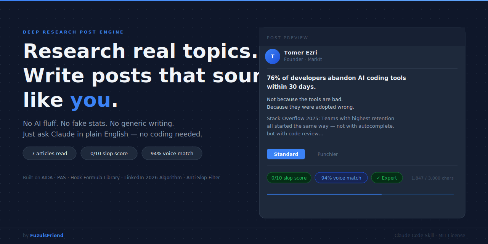

# Deep Research Post Engine

[](LICENSE)
[](SKILL.md)

A Claude Code skill that reads 5-8 real articles on your topic, filters out 59 AI writing patterns, and writes a LinkedIn post that sounds like you.

---

## You don't need to be a developer to use this

This skill is built for founders, creators, and marketers who want better LinkedIn posts without the AI smell. You just tell Claude what you want to write about, in plain English. The skill handles the research, builds a voice profile from your existing posts, runs the anti-slop filter, and delivers a post ready to copy-paste. The only requirement is Claude Code installed on your machine.

---

## What it does

1. 🔍 **Searches broadly** - Runs 8-12 web searches across different angles on your topic to find real data, not just the obvious takes
2. 📖 **Reads full articles** - Fetches the top 5-8 sources in full (not snippets) and extracts real numbers, real quotes, and real expert opinions
3. 💡 **Finds a contrarian angle** - Looks for what the data says that surprises people, then builds the post around that tension
4. 🎤 **Matches your voice** - Builds a voice profile from your best posts and matches your sentence length, punctuation habits, vocabulary level, and emoji usage
5. 🧹 **Strips the slop** - Checks the draft against 59 known AI writing patterns and removes every one before you see the post

---

## Install

```bash
git clone https://github.com/FuzulsFriend/deep-research-post-engine ~/.claude/skills/deep-research-post-engine
```

Then add the recommended MCP for full article reading:

```bash
claude mcp add read-website-fast -s user -- npx -y @just-every/mcp-read-website-fast
```

---

## Usage

Just ask Claude in plain English:

```
Write a LinkedIn post about the ROI of AI coding tools
```

```
Research and write about why most AI startups fail
```

```
Help me post about the GPT-5 announcement for my SaaS audience
```

---

## What you get

```
POST
────────────────────────────────────────
[Full post, ready to paste into LinkedIn]

FIRST COMMENT
────────────────────────────────────────
[2+ source links with titles]

STATS
────────────────────────────────────────
Characters:    1,847 / 3,000
Data points:   8 (all sourced)
AI slop score: 0/10
Voice match:   94%

POSTING GUIDE
────────────────────────────────────────
Best time:     Tuesday 8-9am (your audience's timezone)
Hashtags:      #AITools #SaaS #Productivity
First 60 min:  [engagement plan]
Next post:     [follow-up topic]
```

Plus a visual browser report - opens automatically, shows your post in a LinkedIn-style preview, research evidence, and quality scorecard.

---

## Built on proven research and frameworks

**[LinkedIn Algorithm 2026](https://www.linkedin.com/in/richardvanderblom/) - Richard van der Blom's Annual Algorithm Report**
Van der Blom's report is the most cited independent analysis of how LinkedIn actually distributes content. The skill uses it to optimize posting time, first-comment structure, and hook format for maximum reach in your audience's timezone.

**Anti-Slop Filter - 59 curated AI writing patterns**
Thousands of AI-generated posts were analyzed to identify the phrases and structures that signal "a machine wrote this." The skill checks every draft against all 59 patterns and removes them before the post reaches you.

**[AIDA Framework](https://en.wikipedia.org/wiki/AIDA_(marketing)) - Attention, Interest, Desire, Action (1898)**
AIDA is a 125-year-old copywriting structure that still outperforms most modern alternatives on LinkedIn. The skill uses it to structure posts so the first line earns the second, and the second earns the third.

**Hook Formula Library - Proven first-line patterns from top LinkedIn creators**
The first line of a LinkedIn post determines whether anyone reads line two. The skill pulls from a library of first-line patterns that have driven high saves and shares, then selects the one that fits your specific topic and angle.

**Voice Profiling - Captures your writing fingerprint**
The skill analyzes your existing posts to build a profile of your sentence length, punctuation habits, vocabulary level, and emoji frequency. Every generated post is checked against that profile so it sounds like you wrote it, not like a template.

---

## What's included

```
deep-research-post-engine/
├── SKILL.md                          # Main skill instructions
├── assets/
│   ├── banner.svg                    # Repository banner image
│   ├── preview.png                   # Screenshot of the skill in action
│   ├── post-template.md              # Output format template
│   └── report-ui.html                # Visual browser report template
└── references/
    ├── voice-profile-template.md     # Voice profiling system and brand guardrails
    ├── anti-slop-patterns.md         # 59 AI writing patterns to remove
    ├── linkedin-algorithm-2026.md    # Current algorithm behavior
    ├── post-structures.md            # Proven post frameworks
    ├── hook-formulas.md              # Hook writing formulas
    ├── engagement-playbook.md        # Post-publish engagement tactics
    └── research-methodology.md      # Research pipeline guidelines
```

---

## Works best with

**read-website-fast MCP** - Reads full article text instead of snippets. Without it, the skill falls back to shorter previews.
```bash
claude mcp add read-website-fast -s user -- npx -y @just-every/mcp-read-website-fast
```

**Apify MCP** - Unlocks paywalled articles and social media research.
```bash
claude mcp add apify -s user -- npx -y @apify/actors-mcp-server
```

**Agent Teams** - Runs parallel research agents so the full pipeline finishes 4x faster.
```bash
export CLAUDE_CODE_EXPERIMENTAL_AGENT_TEAMS=1
```

---

## License

MIT

---

*Made by [Tomer E (FuzulsFriend)](https://github.com/FuzulsFriend)*
